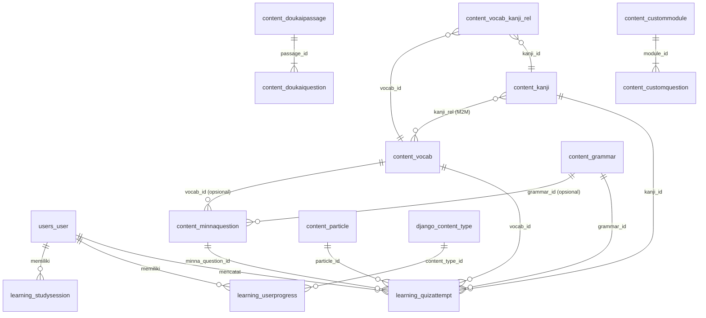

# Database Schema — JBook Blueprint

> **Versi dokumen:** 1.0  
> **Sumber kebenaran (source of truth):** Django ORM — `backend/users/models.py`, `backend/content/models.py`, `backend/learning/models.py`  
> **Engine saat ini:** SQLite 3 (`backend/db.sqlite3`)

---

## 1. Ringkasan Database (Database Overview)

### Jenis Database yang Digunakan

| Lapisan | Engine | File / Lokasi | Peran |
|---------|--------|---------------|-------|
| **Backend (utama)** | SQLite 3 via Django | `backend/db.sqlite3` | Penyimpanan pusat: konten, pengguna, progres belajar, riwayat kuis |
| **Mobile (offline cache)** | SQLite via sqflite | `jbook.db` (perangkat) | Cache subset kanji/vocab/grammar + metadata sinkronisasi |
| **Web (offline cache)** | IndexedDB (browser) | `jbook-offline` v1 | Cache JSON konten & latihan untuk PWA offline |

Konfigurasi backend saat ini:

```python
DATABASES = {
    "default": {
        "ENGINE": "django.db.backends.sqlite3",
        "NAME": BASE_DIR / "db.sqlite3",
    }
}
```

**Rekomendasi engine produksi:**

| Lingkungan | Engine | Alasan |
|------------|--------|--------|
| Pengembangan lokal | **SQLite** | Zero-config, cepat untuk dev & testing |
| Produksi / multi-user | **PostgreSQL** | Concurrent writes, JSONB native, index lanjutan, backup/replikasi |
| Alternatif ringan | **MySQL 8+ / MariaDB** | Kompatibel Django, cocok jika infrastruktur sudah MySQL |

SQLite cocok untuk fase awal dan single-server. Saat traffic pengguna, worker Celery/async, atau kebutuhan analitik bertambah, migrasi ke **PostgreSQL** direkomendasikan tanpa perubahan model Django yang signifikan.

### Tujuan Utama Perancangan

Database JBook dirancang untuk mendukung **aplikasi pembelajaran bahasa Jepang** dengan fokus:

1. **Manajemen konten pembelajaran** — kanji, kosakata (vocab), tata bahasa (grammar/bunpo), partikel, blog, dan pengumuman.
2. **Bank soal terstruktur** — latihan buku *Minna no Nihongo*, latihan membaca (*Doukai*), dan modul latihan kustom (Dokkai/Choukai).
3. **Pelacakan progres pengguna** — sistem SRS (Spaced Repetition System) generik via `UserProgress`, sesi belajar, dan riwayat jawaban kuis.
4. **Workflow kontribusi komunitas** — antrian saran konten (`ContentSuggestion`) dengan token persetujuan.
5. **Replika offline di klien** — mobile & web menyimpan subset data untuk akses tanpa jaringan.

**Ringkasan entitas:** 17 model domain custom + tabel Django bawaan (auth, session, migrations).

---

## 2. Kamus Data & Struktur Tabel (Data Dictionary)

Konvensi penamaan tabel Django: `{app_label}_{model_name_lowercase}`.

### 2.1 `users_user` — Pengguna

Model kustom yang mewarisi `AbstractUser`. Referensi auth: `AUTH_USER_MODEL = "users.User"`.

| Kolom | Tipe Data | Atribut | Fungsi |
|-------|-----------|---------|--------|
| `id` | BIGINT | **PK**, AUTO | Identitas unik pengguna |
| `password` | VARCHAR(128) | NOT NULL | Hash kata sandi |
| `last_login` | TIMESTAMP | NULL | Waktu login terakhir |
| `is_superuser` | BOOLEAN | NOT NULL, DEFAULT false | Akses Django admin penuh |
| `username` | VARCHAR(150) | **UNIQUE**, NOT NULL | Nama pengguna login |
| `first_name` | VARCHAR(150) | NOT NULL, blank allowed | Nama depan |
| `last_name` | VARCHAR(150) | NOT NULL, blank allowed | Nama belakang |
| `email` | VARCHAR(254) | NOT NULL, blank allowed | Alamat email |
| `is_staff` | BOOLEAN | NOT NULL, DEFAULT false | Akses panel admin |
| `is_active` | BOOLEAN | NOT NULL, DEFAULT true | Status akun aktif |
| `date_joined` | TIMESTAMP | NOT NULL | Tanggal registrasi |
| `level_target` | INTEGER | NOT NULL, DEFAULT 5 | Target level JLPT (5=N5 … 1=N1) |

---

### 2.2 `content_kanji` — Kanji

| Kolom | Tipe Data | Atribut | Fungsi |
|-------|-----------|---------|--------|
| `id` | UUID | **PK** | Identitas unik kanji |
| `character` | VARCHAR(1) | NOT NULL | Karakter kanji (1 glyph) |
| `meaning` | VARCHAR(255) | NOT NULL | Arti dalam Bahasa Indonesia |
| `onyomi` | JSON | NOT NULL, DEFAULT `[]` | Daftar bacaan On-yomi |
| `kunyomi` | JSON | NOT NULL, DEFAULT `[]` | Daftar bacaan Kun-yomi |
| `strokes` | INTEGER | NOT NULL | Jumlah goresan |
| `jlpt_level` | INTEGER | NOT NULL | Level JLPT (5=N5 … 1=N1) |
| `radical` | VARCHAR(5) | NULL | Radikal utama |
| `word_type` | VARCHAR(20) | NULL | Tipe kata (noun, godan, i_adj, dll.) |
| `examples` | JSON | NOT NULL, DEFAULT `[]` | Contoh kata & arti |
| `svg_data` | TEXT | NULL | Data SVG mentah (KanjiVG) untuk animasi goresan |

---

### 2.3 `content_grammar` — Tata Bahasa (Bunpo)

| Kolom | Tipe Data | Atribut | Fungsi |
|-------|-----------|---------|--------|
| `id` | UUID | **PK** | Identitas unik pola grammar |
| `title` | VARCHAR(255) | NOT NULL | Judul / nama pola |
| `structure` | VARCHAR(255) | NOT NULL | Struktur kalimat (e.g. `〜てください`) |
| `explanation` | TEXT | NOT NULL | Penjelasan detail (Bahasa Indonesia) |
| `chapter` | INTEGER | NOT NULL, DEFAULT 0 | Nomor bab |
| `jlpt_level` | INTEGER | NOT NULL | Level JLPT |
| `sentences` | JSON | NOT NULL, DEFAULT `[]` | Contoh kalimat + terjemahan |

---

### 2.4 `content_vocab` — Kosakata (Kotoba)

| Kolom | Tipe Data | Atribut | Fungsi |
|-------|-----------|---------|--------|
| `id` | UUID | **PK** | Identitas unik kosakata |
| `word` | VARCHAR(255) | NOT NULL | Kata dalam kanji/kana |
| `reading` | VARCHAR(255) | NOT NULL | Cara baca (romaji/kana) |
| `furigana` | VARCHAR(255) | NULL | Furigana spesifik |
| `meaning` | VARCHAR(255) | NOT NULL | Arti Bahasa Indonesia |
| `word_type` | VARCHAR(20) | NULL | Tipe kata |
| `jlpt_level` | INTEGER | NOT NULL, DEFAULT 5 (N5) | Level JLPT |
| `examples` | JSON | NOT NULL, DEFAULT `[]` | Contoh kalimat |

> **Relasi M2M:** Kanji yang terkandung dalam kata dihubungkan via tabel `content_vocab_kanji_rel` (lihat §3).

---

### 2.5 `content_vocab_kanji_rel` — Junction Vocab ↔ Kanji

| Kolom | Tipe Data | Atribut | Fungsi |
|-------|-----------|---------|--------|
| `id` | BIGINT | **PK**, AUTO | ID baris junction |
| `vocab_id` | UUID | **FK** → `content_vocab.id` | Kosakata |
| `kanji_id` | UUID | **FK** → `content_kanji.id` | Kanji komponen |

---

### 2.6 `content_particle` — Partikel

| Kolom | Tipe Data | Atribut | Fungsi |
|-------|-----------|---------|--------|
| `id` | UUID | **PK** | Identitas unik partikel |
| `character` | VARCHAR(10) | NOT NULL | Karakter partikel (は, が, を, …) |
| `meaning` | VARCHAR(255) | NOT NULL | Arti/fungsi singkat |
| `explanation` | TEXT | NOT NULL | Penjelasan penggunaan |
| `jlpt_level` | INTEGER | NOT NULL, DEFAULT 5 | Level JLPT |
| `sentences` | JSON | NOT NULL, DEFAULT `[]` | Contoh kalimat dengan placeholder |

---

### 2.7 `content_blog` — Artikel Blog

| Kolom | Tipe Data | Atribut | Fungsi |
|-------|-----------|---------|--------|
| `id` | UUID | **PK** | Identitas unik artikel |
| `title` | VARCHAR(255) | NOT NULL | Judul artikel |
| `slug` | VARCHAR(255) | **UNIQUE**, NOT NULL | URL slug SEO-friendly |
| `content` | TEXT | NOT NULL | Isi (Markdown/HTML) |
| `tags` | JSON | NOT NULL, DEFAULT `[]` | Tag/kategori |
| `is_published` | BOOLEAN | NOT NULL, DEFAULT false | Status publikasi |
| `created_at` | TIMESTAMP | NOT NULL, auto | Waktu dibuat |
| `updated_at` | TIMESTAMP | NOT NULL, auto | Waktu diperbarui |

---

### 2.8 `content_contentsuggestion` — Saran Konten Komunitas

| Kolom | Tipe Data | Atribut | Fungsi |
|-------|-----------|---------|--------|
| `id` | UUID | **PK** | Identitas saran |
| `type` | VARCHAR(10) | NOT NULL | Jenis: `kanji` atau `bunpo` |
| `data` | JSON | NOT NULL | Payload data saran |
| `status` | VARCHAR(10) | NOT NULL, DEFAULT `pending` | `pending` / `approved` / `rejected` |
| `approval_token` | UUID | NOT NULL | Token one-time untuk persetujuan |
| `created_at` | TIMESTAMP | NOT NULL, auto | Waktu pengajuan |

---

### 2.9 `content_announcement` — Pengumuman

| Kolom | Tipe Data | Atribut | Fungsi |
|-------|-----------|---------|--------|
| `id` | UUID | **PK** | Identitas pengumuman |
| `title` | VARCHAR(255) | NOT NULL | Judul |
| `content` | TEXT | NOT NULL | Isi pengumuman |
| `type` | VARCHAR(20) | NOT NULL, DEFAULT `info` | `info` / `warning` / `important` / `success` |
| `is_active` | BOOLEAN | NOT NULL, DEFAULT true | Aktif/nonaktif |
| `show_as_popup` | BOOLEAN | NOT NULL, DEFAULT false | Tampil sebagai modal vs banner |
| `priority` | INTEGER | NOT NULL, DEFAULT 0 | Urutan tampil (lebih besar = lebih awal) |
| `show_from` | TIMESTAMP | NULL | Mulai ditampilkan |
| `show_until` | TIMESTAMP | NULL | Berakhir ditampilkan |
| `deleted_at` | TIMESTAMP | NULL | Soft delete |
| `created_at` | TIMESTAMP | NOT NULL, auto | Waktu dibuat |
| `updated_at` | TIMESTAMP | NOT NULL, auto | Waktu diperbarui |

---

### 2.10 `content_minnaquestion` — Soal Minna no Nihongo

| Kolom | Tipe Data | Atribut | Fungsi |
|-------|-----------|---------|--------|
| `id` | UUID | **PK** | Identitas soal |
| `book` | INTEGER | NOT NULL | Buku: `1` = Minna 1, `2` = Minna 2 |
| `chapter` | INTEGER | NOT NULL | Nomor bab |
| `question_type` | VARCHAR(20) | NOT NULL | `fill_blank` / `context_match` / `choice` |
| `question_jp` | TEXT | NOT NULL | Teks soal (Jepang) |
| `question_id` | TEXT | NOT NULL, blank allowed | Konteks soal (Indonesia, opsional) |
| `correct_answer` | VARCHAR(512) | NOT NULL | Jawaban benar |
| `options` | JSON | NOT NULL, DEFAULT `[]` | Daftar pilihan jawaban |
| `explanation` | TEXT | NOT NULL, blank allowed | Penjelasan pasca-jawab |
| `grammar_id` | UUID | **FK** → `content_grammar.id`, NULL, ON DELETE SET NULL | Grammar terkait |
| `vocab_id` | UUID | **FK** → `content_vocab.id`, NULL, ON DELETE SET NULL | Kosakata terkait |
| `jlpt_level` | INTEGER | NOT NULL, DEFAULT 5 | Level JLPT |
| `created_at` | TIMESTAMP | NOT NULL, auto | Waktu dibuat |

**Index eksplisit:** `(book, chapter)`, `(question_type, jlpt_level)`

---

### 2.11 `content_doukaipassage` — Passage Membaca (Doukai)

| Kolom | Tipe Data | Atribut | Fungsi |
|-------|-----------|---------|--------|
| `id` | UUID | **PK** | Identitas passage |
| `title` | VARCHAR(300) | NOT NULL | Judul cerita (Indonesia) |
| `text_jp` | TEXT | NOT NULL | Teks cerita (Jepang) |
| `text_id` | TEXT | NOT NULL, blank allowed | Terjemahan Indonesia |
| `book` | INTEGER | NULL | Minna 1/2 (opsional) |
| `chapter` | INTEGER | NULL | Nomor bab (opsional) |
| `jlpt_level` | INTEGER | NULL | Level JLPT (opsional) |
| `created_at` | TIMESTAMP | NOT NULL, auto | Waktu dibuat |

**Index eksplisit:** `(book, chapter)`

---

### 2.12 `content_doukaiquestion` — Soal Benar/Salah Doukai

| Kolom | Tipe Data | Atribut | Fungsi |
|-------|-----------|---------|--------|
| `id` | UUID | **PK** | Identitas soal |
| `passage_id` | UUID | **FK** → `content_doukaipassage.id`, NOT NULL, ON DELETE CASCADE | Passage induk |
| `question_text` | TEXT | NOT NULL | Pernyataan tentang isi cerita |
| `is_correct` | BOOLEAN | NOT NULL | `true` = pernyataan benar sesuai cerita |
| `explanation` | TEXT | NOT NULL, blank allowed | Penjelasan |
| `order` | INTEGER | NOT NULL, DEFAULT 0 | Urutan tampil |

---

### 2.13 `content_custommodule` — Modul Latihan Kustom

| Kolom | Tipe Data | Atribut | Fungsi |
|-------|-----------|---------|--------|
| `id` | UUID | **PK** | Identitas modul |
| `title` | VARCHAR(255) | NOT NULL | Judul modul |
| `description` | TEXT | NOT NULL, blank allowed | Deskripsi |
| `module_type` | VARCHAR(20) | NOT NULL, DEFAULT `general` | `general` / `dokkai` / `choukai` |
| `passage` | TEXT | NOT NULL, blank allowed | Teks bacaan (Dokkai) |
| `audio_url` | VARCHAR(512) | NOT NULL, blank allowed | URL audio (Choukai) |
| `is_published` | BOOLEAN | NOT NULL, DEFAULT false | Status publikasi |
| `created_at` | TIMESTAMP | NOT NULL, auto | Waktu dibuat |
| `updated_at` | TIMESTAMP | NOT NULL, auto | Waktu diperbarui |

---

### 2.14 `content_customquestion` — Soal Modul Kustom

| Kolom | Tipe Data | Atribut | Fungsi |
|-------|-----------|---------|--------|
| `id` | UUID | **PK** | Identitas soal |
| `module_id` | UUID | **FK** → `content_custommodule.id`, NOT NULL, ON DELETE CASCADE | Modul induk |
| `question_type` | VARCHAR(20) | NOT NULL, DEFAULT `choice` | `choice` / `true_false` / `fill_blank` |
| `question_text` | TEXT | NOT NULL | Teks soal |
| `options` | JSON | NOT NULL, DEFAULT `[]`, blank allowed | Pilihan (jika pilihan ganda) |
| `correct_answer` | VARCHAR(512) | NOT NULL | Jawaban benar |
| `explanation` | TEXT | NOT NULL, blank allowed | Penjelasan |
| `order` | INTEGER | NOT NULL, DEFAULT 0 | Urutan tampil |

---

### 2.15 `learning_studysession` — Sesi Belajar

| Kolom | Tipe Data | Atribut | Fungsi |
|-------|-----------|---------|--------|
| `id` | UUID | **PK** | Identitas sesi |
| `user_id` | BIGINT | **FK** → `users_user.id`, NOT NULL, ON DELETE CASCADE | Pengguna |
| `start_time` | TIMESTAMP | NOT NULL, auto | Waktu mulai |
| `end_time` | TIMESTAMP | NULL | Waktu selesai (NULL = masih aktif) |

---

### 2.16 `learning_userprogress` — Progres SRS (Generic)

Menggunakan **Generic Foreign Key** — satu baris progres dapat merujuk ke Kanji, Vocab, Grammar, atau Particle.

| Kolom | Tipe Data | Atribut | Fungsi |
|-------|-----------|---------|--------|
| `id` | UUID | **PK** | Identitas progres |
| `user_id` | BIGINT | **FK** → `users_user.id`, NOT NULL, ON DELETE CASCADE | Pengguna |
| `content_type_id` | INTEGER | **FK** → `django_content_type.id`, NOT NULL, ON DELETE CASCADE | Tipe model konten |
| `object_id` | UUID | NOT NULL | ID objek konten yang dirujuk |
| `srs_stage` | INTEGER | NOT NULL, DEFAULT 0 | Tahap SRS (0 = baru) |
| `next_review` | TIMESTAMP | NULL | Jadwal review berikutnya |
| `last_reviewed` | TIMESTAMP | NULL | Review terakhir |

**Index eksplisit:** `(content_type_id, object_id)`

> **Catatan:** Tidak ada `UNIQUE (user_id, content_type_id, object_id)` — duplikat progres per user+item **memungkinkan** di level DB.

---

### 2.17 `learning_quizattempt` — Riwayat Jawaban Kuis

Satu baris merekam satu attempt. Hanya **satu** FK konten yang seharusnya terisi (dijaga di aplikasi, bukan constraint DB).

| Kolom | Tipe Data | Atribut | Fungsi |
|-------|-----------|---------|--------|
| `id` | UUID | **PK** | Identitas attempt |
| `user_id` | BIGINT | **FK** → `users_user.id`, NOT NULL, ON DELETE CASCADE | Pengguna |
| `kanji_id` | UUID | **FK** → `content_kanji.id`, NULL, ON DELETE CASCADE | Kanji (jika mode kanji) |
| `vocab_id` | UUID | **FK** → `content_vocab.id`, NULL, ON DELETE CASCADE | Vocab (jika mode vocab) |
| `grammar_id` | UUID | **FK** → `content_grammar.id`, NULL, ON DELETE CASCADE | Grammar (jika mode bunpo) |
| `particle_id` | UUID | **FK** → `content_particle.id`, NULL, ON DELETE CASCADE | Partikel |
| `minna_question_id` | UUID | **FK** → `content_minnaquestion.id`, NULL, ON DELETE CASCADE | Soal Minna |
| `is_correct` | BOOLEAN | NOT NULL | Benar/salah |
| `answer_given` | VARCHAR(255) | NULL | Jawaban yang diberikan user |
| `timestamp` | TIMESTAMP | NOT NULL | Waktu attempt |
| `mode` | VARCHAR(20) | NOT NULL, DEFAULT `choice` | Mode kuis |

---

### 2.18 Tabel Django Bawaan (Ringkas)

| Tabel | Fungsi |
|-------|--------|
| `django_migrations` | Riwayat migrasi schema |
| `django_content_type` | Registry model (dipakai Generic FK) |
| `django_session` | Session server-side |
| `auth_group` / `auth_permission` | RBAC Django |
| `auth_group_permissions` | M2M Group ↔ Permission |
| `users_user_groups` | M2M User ↔ Group |
| `users_user_user_permissions` | M2M User ↔ Permission |

---

### 2.19 Penyimpanan Klien (Replika Offline)

#### Mobile SQLite (`jbook.db`)

| Tabel | Kolom Utama | Catatan |
|-------|-------------|---------|
| `kanji` | `id`, `character`, `meaning`, `onyomi`, `kunyomi`, `strokes`, `jlpt_level` | `onyomi`/`kunyomi` diserialisasi sebagai string CSV |
| `vocab` | `id`, `word`, `reading`, `furigana`, `meaning`, `jlpt_level` | Subset backend |
| `grammar` | `id`, `title`, `structure`, `explanation`, `chapter`, `jlpt_level` | Subset backend |
| `sync_meta` | `key`, `value` | Metadata sinkronisasi (schema v2) |

Tidak ada FK atau index sekunder di mobile DB.

#### Web IndexedDB (`jbook-offline` v1)

| Object Store | Key Path | Fungsi |
|--------------|----------|--------|
| `vocab` | `id` | Cache kosakata (JSON bebas) |
| `kanji` | `id` | Cache kanji |
| `grammar` | `id` | Cache grammar |
| `practice` | `id` | Cache set soal latihan |
| `meta` | `id` (autoIncrement) | Timestamp & versi download |

Skema IndexedDB **schemaless** — struktur record mengikuti respons API.

---

## 3. Relasi Antar Tabel (Entity-Relationship Analysis)

### Diagram Relasi Utama



### Ringkasan Relasi

| Relasi | Tipe | Jembatan (FK / Junction) | Keterangan |
|--------|------|--------------------------|------------|
| User → StudySession | **One-to-Many** | `learning_studysession.user_id` | Satu user, banyak sesi |
| User → UserProgress | **One-to-Many** | `learning_userprogress.user_id` | Progres SRS per item konten |
| User → QuizAttempt | **One-to-Many** | `learning_quizattempt.user_id` | Riwayat jawaban |
| Vocab ↔ Kanji | **Many-to-Many** | `content_vocab_kanji_rel` (`vocab_id`, `kanji_id`) | Satu kata bisa punya banyak kanji; satu kanji muncul di banyak kata |
| Grammar → MinnaQuestion | **One-to-Many** (opsional) | `content_minnaquestion.grammar_id` | ON DELETE SET NULL |
| Vocab → MinnaQuestion | **One-to-Many** (opsional) | `content_minnaquestion.vocab_id` | ON DELETE SET NULL |
| DoukaiPassage → DoukaiQuestion | **One-to-Many** | `content_doukaiquestion.passage_id` | ON DELETE CASCADE |
| CustomModule → CustomQuestion | **One-to-Many** | `content_customquestion.module_id` | ON DELETE CASCADE |
| Konten → QuizAttempt | **One-to-Many** (polimorfik manual) | `kanji_id`, `vocab_id`, `grammar_id`, `particle_id`, `minna_question_id` | Hanya satu FK konten terisi per baris (logika app) |
| Konten → UserProgress | **Polimorfik (Generic FK)** | `content_type_id` + `object_id` | Mendukung SRS untuk berbagai tipe konten |

### Tabel Mandiri (Tanpa FK Keluar)

`content_blog`, `content_contentsuggestion`, `content_announcement`, `content_particle` (sebagai induk), `content_kanji`, `content_grammar`, `content_vocab` — entitas konten independen yang dirujuk oleh tabel lain.

---

## 4. Catatan Optimasi & Rekomendasi (Database Best Practices)

### 4.1 Evaluasi Normalisasi

| Aspek | Status | Penilaian |
|-------|--------|-----------|
| **1NF** | ✅ | Semua kolom atomik; JSON dipakai untuk array terstruktur (onyomi, options, examples) — trade-off praktis untuk konten fleksibel |
| **2NF** | ✅ | Tidak ada partial dependency; semua non-key field bergantung pada PK |
| **3NF** | ✅ | Tidak ada transitive dependency antar kolom non-key |
| **Denormalisasi terkontrol** | ⚠️ | JSON fields (`examples`, `sentences`, `options`) menggabungkan data terkait — acceptable untuk CMS/edukasi, kurangi join |
| **Integritas polimorfik** | ⚠️ | `QuizAttempt` (multi nullable FK) dan `UserProgress` (Generic FK) tidak dijaga constraint DB |

**Kesimpulan:** Skema sudah **cukup normal** untuk domain pembelajaran. JSON fields adalah pilihan desain yang wajar agar konten edukatif fleksibel tanpa tabel anak berlebihan.

### 4.2 Index yang Sudah Ada

| Tabel | Index | Nama (migration) |
|-------|-------|------------------|
| `content_minnaquestion` | `(book, chapter)` | `content_min_book_079156_idx` |
| `content_minnaquestion` | `(question_type, jlpt_level)` | `content_min_questio_3e88c6_idx` |
| `content_doukaipassage` | `(book, chapter)` | `content_dou_book_8cbc98_idx` |
| `learning_userprogress` | `(content_type_id, object_id)` | `learning_us_content_be468e_idx` |
| Implisit | PK semua tabel | — |
| Implisit | `users_user.username`, `content_blog.slug` | UNIQUE |
| Implisit | Semua kolom FK | Index otomatis Django |

### 4.3 Rekomendasi Index Tambahan

| Tabel | Kolom | Alasan |
|-------|-------|--------|
| `learning_userprogress` | `(user_id, content_type_id, object_id)` | Query SRS per user; **plus UNIQUE constraint** untuk cegah duplikat progres |
| `learning_userprogress` | `(user_id, next_review)` | Query "item due for review today" |
| `learning_quizattempt` | `(user_id, timestamp DESC)` | Dashboard riwayat & statistik user |
| `learning_quizattempt` | `(user_id, kanji_id)`, `(user_id, vocab_id)`, dll. | Analitik akurasi per tipe konten |
| `learning_studysession` | `(user_id, start_time DESC)` | Riwayat sesi belajar |
| `content_kanji` | `(jlpt_level)` | Filter kanji per level JLPT |
| `content_vocab` | `(jlpt_level)` | Filter kosakata per level |
| `content_grammar` | `(chapter, jlpt_level)` | Navigasi per bab |
| `content_announcement` | `(is_active, priority DESC, show_from, show_until)` | Query pengumuman aktif |
| `content_blog` | `(is_published, created_at DESC)` | Listing blog publik |
| `content_custommodule` | `(is_published, module_type)` | Filter modul publik |
| `content_vocab_kanji_rel` | `(kanji_id)` | Reverse lookup: kanji → vocab (FK vocab_id sudah ter-index) |

### 4.4 Rekomendasi Constraint & Schema

| Prioritas | Rekomendasi | Detail |
|-----------|-------------|--------|
| 🔴 Tinggi | **UNIQUE pada UserProgress** | `unique_together = ('user', 'content_type', 'object_id')` — cegah duplikat SRS |
| 🔴 Tinggi | **Check constraint QuizAttempt** | Pastikan tepat satu FK konten terisi (PostgreSQL `CHECK` atau validasi Django `clean()`) |
| 🟡 Sedang | **Index full-text search** | PostgreSQL `GIN` pada `content_vocab.word`, `content_kanji.character`, `content_grammar.title` untuk pencarian admin/OmniSearch |
| 🟡 Sedang | **Soft delete konsisten** | `Announcement.deleted_at` sudah ada; pertimbangkan pola serupa untuk konten utama jika perlu audit trail |
| 🟡 Sedang | **Sinkronisasi skema klien** | Mobile SQLite & IndexedDB hanya subset — dokumentasikan mapping field (e.g. `onyomi` JSON → CSV string) |
| 🟢 Rendah | **Migrasi PostgreSQL** | Saat deploy produksi: gunakan `JSONB`, connection pooling (PgBouncer), backup harian |
| 🟢 Rendah | **Partisi QuizAttempt** | Jika jutaan baris: partisi by `timestamp` (monthly) di PostgreSQL |

### 4.5 Catatan JSON Fields

Kolom JSON (`onyomi`, `kunyomi`, `examples`, `options`, `sentences`, `tags`, `data`) mempermudah iterasi konten tanpa migrasi schema. Trade-off:

- ✅ Fleksibilitas struktur contoh kalimat & pilihan jawaban
- ⚠️ Query filter di dalam JSON lebih lambat di SQLite (PostgreSQL JSONB lebih baik)
- ⚠️ Validasi struktur JSON harus dijaga di serializer/Pydantic, bukan di DB

### 4.6 Migrasi & Versioning

- **30 file migrasi Django** (`content`: 21, `learning`: 8, `users`: 1)
- Mobile schema version: **2** (penambahan `sync_meta`)
- IndexedDB version: **1**

Selalu jalankan `python manage.py migrate` setelah pull perubahan model.

---

## Lampiran: Referensi Cepat Tipe Konten

| Nilai `jlpt_level` | Level |
|--------------------|-------|
| 5 | N5 |
| 4 | N4 |
| 3 | N3 |
| 2 | N2 |
| 1 | N1 |

| Model | App Label | Tabel DB |
|-------|-----------|----------|
| User | `users` | `users_user` |
| Kanji, Grammar, Vocab, Particle, Blog, ContentSuggestion, Announcement, MinnaQuestion, DoukaiPassage, DoukaiQuestion, CustomModule, CustomQuestion | `content` | `content_*` |
| StudySession, UserProgress, QuizAttempt | `learning` | `learning_*` |

---

*Dokumen ini dihasilkan dari review kode sumber JBook. Perbarui dokumen ini setiap kali ada perubahan pada file `models.py` atau migrasi Django.*
