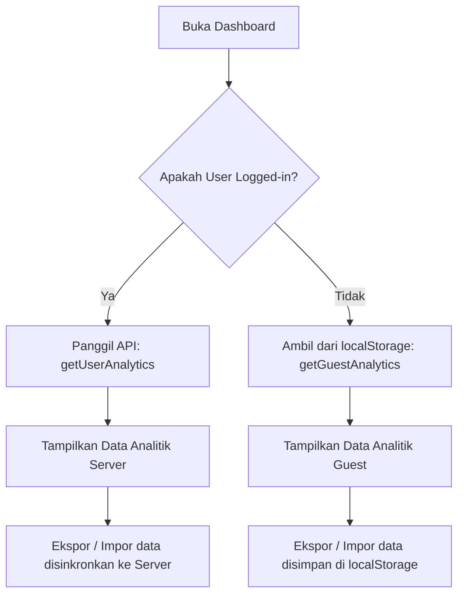

# Dokumentasi Dashboard Pengguna (User Dashboard)

Dokumen ini menjelaskan struktur, pembagian halaman, alur data, serta detail teknis mengenai Dashboard Pengguna pada platform JBook.

---

## 1. Arsitektur & Pembagian Halaman

Dashboard pengguna yang sebelumnya berada dalam satu halaman besar kini dibagi menjadi beberapa sub-halaman fungsional di bawah folder `/app/dashboard/` untuk meningkatkan keterbacaan kode, kenyamanan performa rendering, serta pengalaman navigasi pengguna:

| Halaman | Rute (Route) | Deskripsi Utama | Komponen / Widget Utama |
| :--- | :--- | :--- | :--- |
| **Ringkasan (Overview)** | `/dashboard` | Gambaran umum aktivitas dan performa belajar pengguna. | Banner Tamu, Kartu Akurasi Rata-rata & Total Soal, Saran Belajar & Insight Dinamis. |
| **Akurasi Level JLPT** | `/dashboard/levels` | Rincian performa akurasi belajar berdasarkan level JLPT (N5 - N1). | Grid Akurasi Level, Progress bar interaktif. |
| **Analisis Kakitori** | `/dashboard/kakitori` | Statistik latihan dikte (kakitori) untuk menguji kemampuan pendengaran. | Sesi dikte, akurasi dikte, breakdown level, tips latihan pendengaran. |
| **Analisis Kesalahan** | `/dashboard/mistakes` | Analisis item yang paling sering salah dijawab beserta sebaran kategori materi. | Tabel top salah (Kanji/Kotoba/Bunpo) terintegrasi dengan modal detail, sebaran kategori salah. |
| **Riwayat Jawaban** | `/dashboard/history` | Log seluruh jawaban latihan yang pernah dimasukkan oleh pengguna. | Tabel log jawaban, filter tipe, pagination. |
| **Manajemen Data** | `/dashboard/data` | Fitur ekspor/impor data pencapaian untuk kebutuhan pencadangan & sinkronisasi perangkat. | Ekspor file JSON, Impor file JSON dengan validasi skema. |

---

## 2. Navigasi & Tata Letak (Layout)

Navigasi antar halaman dashboard dikelola secara tersentralisasi melalui **`dashboard/layout.jsx`**. Tata letak ini bertindak sebagai pembungkus (*wrapper*) yang menjaga:
- Konten navigasi tetap berada di atas (atau di samping pada layar lebar).
- Efek visual tab aktif berbasis penandaan rute Next.js (`usePathname`).
- Keberlangsungan state global (seperti tema, otentikasi) tanpa re-render berlebihan saat berpindah halaman dashboard.

---

## 3. Alur Pengambilan & Sinkronisasi Data

Pengambilan data analitik di semua halaman dashboard mengikuti metode hibrida berdasarkan status login pengguna:

### Penanganan Mode Tamu (Guest)
- Data latihan disimpan pada key `guest_practice_analytics` di `localStorage`.
- Jika pengguna memutuskan untuk masuk/mendaftar, disediakan banner ajakan untuk memindahkan data lokal tersebut ke server database.

### Manajemen Ekspor/Impor
- **Ekspor**: Mengompilasi seluruh riwayat (termasuk data kakitori) ke dalam format file JSON standard.
- **Impor**:
  - Melakukan validasi format JSON.
  - Untuk pengguna masuk, mengirimkan payload JSON ke API Server (`importPracticeData`).
  - Untuk Guest, melakukan penulisan ulang ke `localStorage` setelah memastikan atribut minimal (seperti `kakitori_stats` dan `total_attempts`) sudah valid.
